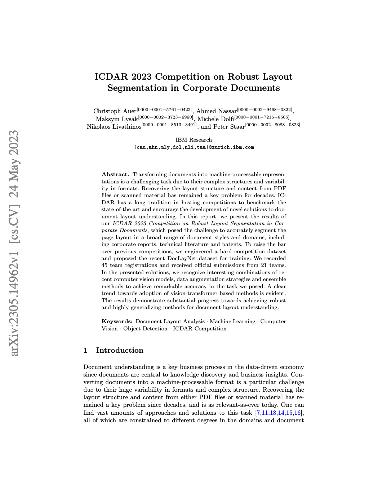
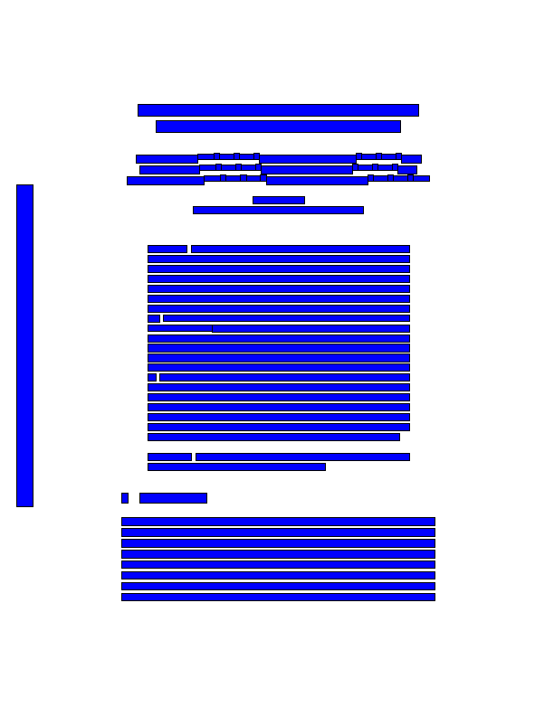
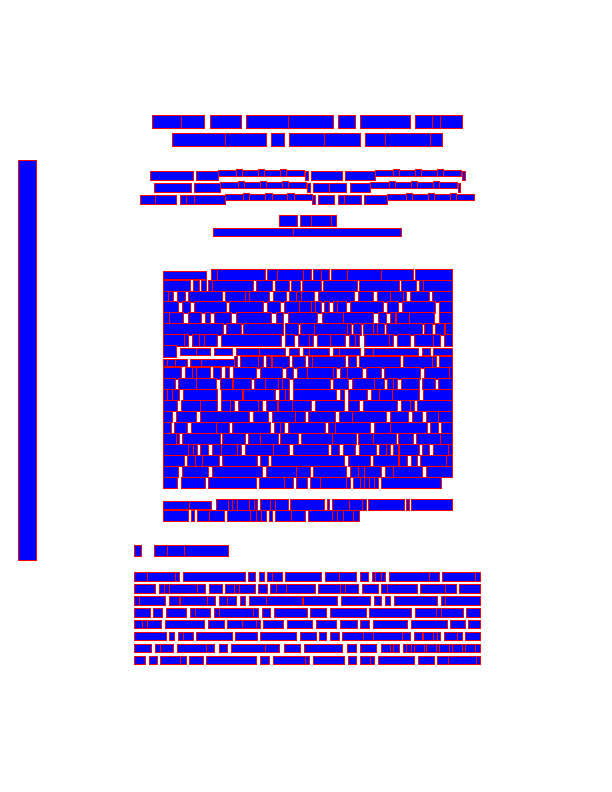

# Docling Parse

[](https://pypi.org/project/docling-parse/)
[](https://pypi.org/project/docling-parse/)
[](https://python-poetry.org/)
[](https://github.com/pybind/pybind11/)
[](https://github.com/DS4SD/docling-parse/)
[](https://opensource.org/licenses/MIT)

Simple package to extract text, paths and bitmap images with coordinates from programmatic PDFs.
This package is used in the [Docling](https://github.com/DS4SD/docling) PDF conversion.

<table>
  <tr>
    <th>Version</th>
    <th>Original</th>
    <th>Word-level</th>
    <th>Snippet-level</th>
    <th>Performance</th>
  </tr>
  <tr>
    <th>V1</th>
    <td rowspan="2"></td>
    <td>Not Supported</td>
    <td></td>
    <td>~0.250 page/sec</td>
  </tr>
  <tr>
    <th>V2</th>
    <!-- The "Original" column image spans from the previous row -->
    <td></td>
    <td></td>
    <td>~0.050 page/sec <br><br>[~5-10X faster than v1]</td>
  </tr>
</table>

## Quick start

Install the package from Pypi

```sh
pip install docling-parse
```

Convert a PDF (look in the [visualise.py](docling_parse/visualise.py) for a more detailed information)

```python
from docling_parse.docling_parse import pdf_parser_v2

# Do this only once to load fonts (avoid initialising it many times)
parser = pdf_parser_v2()

# parser.set_loglevel(1) # 1=error, 2=warning, 3=success, 4=info

doc_file = "my-doc.pdf" # filename
doc_key = f"key={pdf_doc}" # unique document key (eg hash, UUID, etc)

# Load the document from file using filename doc_file. This only loads
# the QPDF document, but no extracted data
success = parser.load_document(doc_key, doc_file)

# Open the file in binary mode and read its contents
# with open(pdf_doc, "rb") as file:
#      file_content = file.read()

# Create a BytesIO object and write the file contents to it
# bytes_io = io.BytesIO(file_content)
# success = parser.load_document_from_bytesio(doc_key, bytes_io)

# Parse the entire document in one go, easier, but could require
# a lot (more) memory as parsing page-by-page
# json_doc = parser.parse_pdf_from_key(doc_key)	

# Get number of pages
num_pages = parser.number_of_pages(doc_key)

# Parse page by page to minimize memory footprint
for page in range(0, num_pages):

    # Internal memory for page is auto-deleted after this call.
    # No need to unload a specifc page 
    json_doc = parser.parse_pdf_from_key_on_page(doc_key, page)

    if "pages" not in json_doc:  # page could not get parsed
       continue

    # parsed page is the first one!				  
    json_page = json_doc["pages"][0] 
    
	# <Insert your own code>

# Unload the (QPDF) document and buffers
parser.unload_document(doc_key)

# Unloads everything at once
# parser.unload_documents()
```

Use the CLI

```sh
$ docling-parse -h
usage: docling-parse [-h] -p PDF

Process a PDF file.

options:
  -h, --help         show this help message and exit
  -p PDF, --pdf PDF  Path to the PDF file
```

## Performance Benchmarks

We ran the v1 and v2 parser on [DocLayNet](https://huggingface.co/datasets/ds4sd/DocLayNet-v1.1). We found the following overall behavior


## Development

### CXX

To build the parse, simply run the following command in the root folder,

```sh
rm -rf build; cmake -B ./build; cd build; make
```

You can run the parser from your build folder. Example from parse_v1,

```sh
% ./parse_v1.exe -h
A program to process PDF files or configuration files
Usage:
  PDFProcessor [OPTION...]

  -i, --input arg          Input PDF file
  -c, --config arg         Config file
      --create-config arg  Create config file
  -o, --output arg         Output file
  -l, --loglevel arg       loglevel [error;warning;success;info]
  -h, --help               Print usage
```

Example from parse_v2,

```sh
% ./parse_v2.exe -h
program to process PDF files or configuration files
Usage:
  PDFProcessor [OPTION...]

  -i, --input arg          Input PDF file
  -c, --config arg         Config file
      --create-config arg  Create config file
  -p, --page arg           Pages to process (default: -1 for all) (default:
                           -1)
  -o, --output arg         Output file
  -l, --loglevel arg       loglevel [error;warning;success;info]
  -h, --help               Print usage
```

If you dont have an input file, then a template input file will be printed on the terminal.


### Python

To build the package, simply run (make sure [poetry](https://python-poetry.org/) is [installed](https://python-poetry.org/docs/#installing-with-the-official-installer)),

```
poetry build
```

To test the package, run:

```
poetry run pytest ./tests -v -s
```


## Contributing

Please read [Contributing to Docling Parse](https://github.com/DS4SD/docling-parse/blob/main/CONTRIBUTING.md) for details.


## References

If you use Docling in your projects, please consider citing the following:

```bib
@techreport{Docling,
  author = {Deep Search Team},
  month = {8},
  title = {Docling Technical Report},
  url = {https://arxiv.org/abs/2408.09869},
  eprint = {2408.09869},
  doi = {10.48550/arXiv.2408.09869},
  version = {1.0.0},
  year = {2024}
}
```

## License

The Docling Parse codebase is under MIT license.
For individual model usage, please refer to the model licenses found in the original packages.
